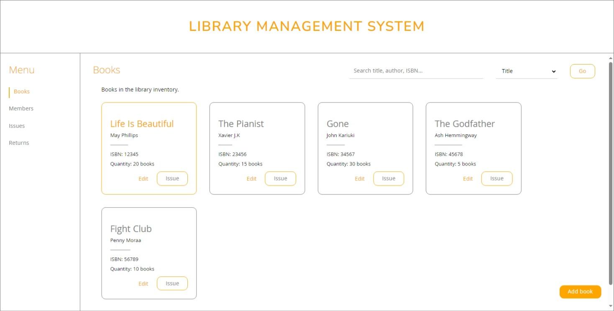
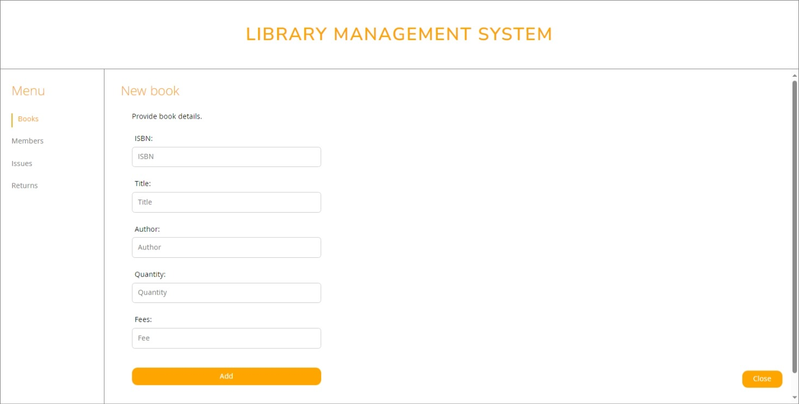
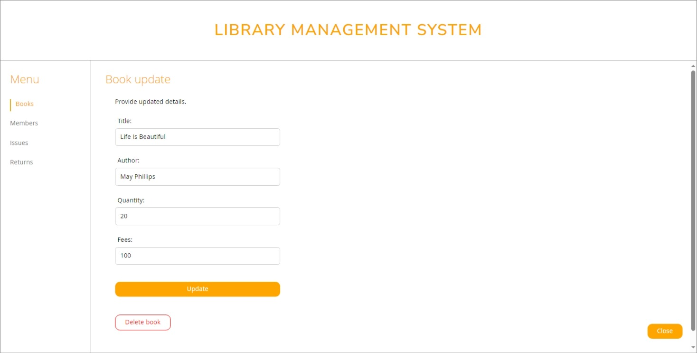
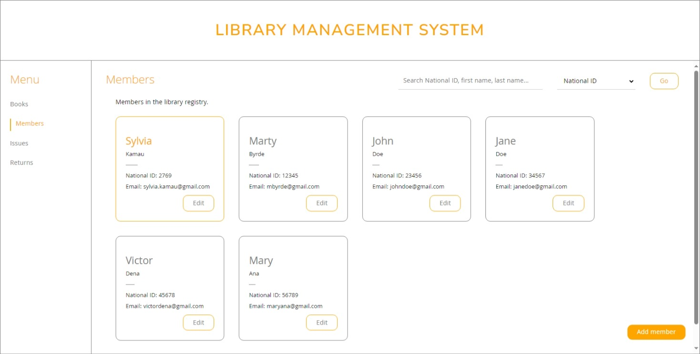
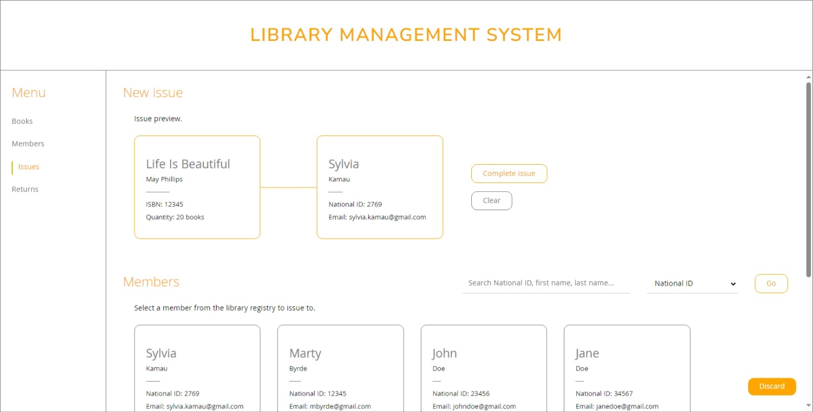
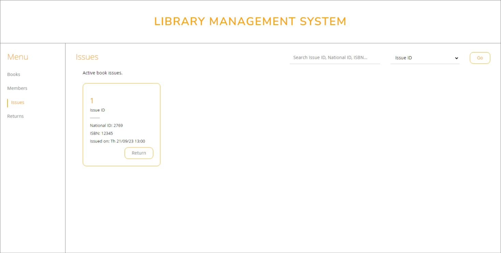
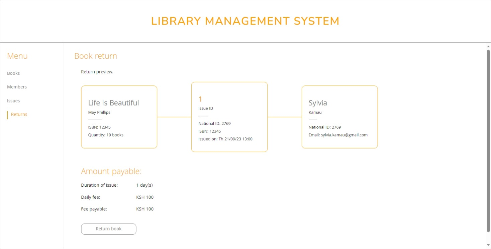
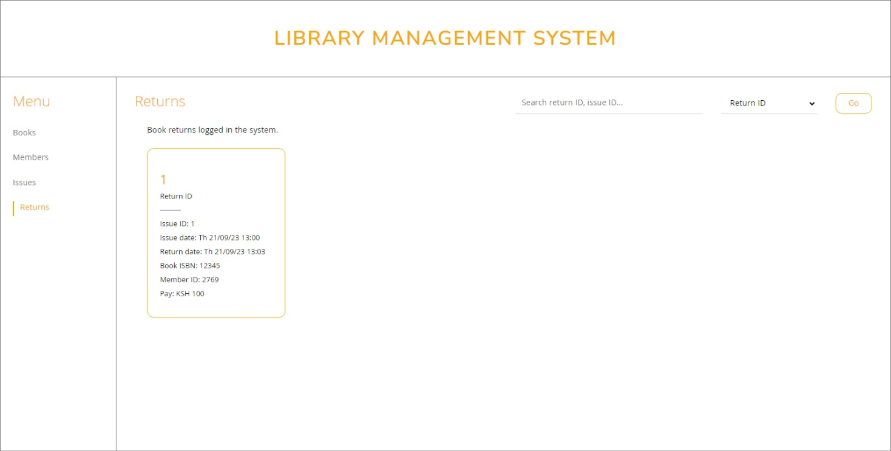

# **LIBRARY MANAGEMENT SYSTEM (LMS)**

## Introduction

The LMS is a web application that eases the tracking of book issues and returns in a library's inventory. This includes book stocks, active issues, return logs and rent charges for each issue. In addition to book-related transactions, a member registry is maintained against which book records are made.

Given the context of its use - and the scope of the project - the LMS was designed with just the administrator's interface (i.e the librarian's dashboard).

## Walkthrough

- Viewing books in the library inventory:
  
  - `Issue` redirects to the `Issue` page and preloads the selected book for issue
  - `Edit` opens the book update form with an option to delete
  - Can search by title, author and ISBN
- Adding a new book:
  
  - The ISBN is a required field
- Updating/deleting an existing book:
  
  - The selected book's ISBN is immutable
- Viewing members in the library registry:
  
  - `Edit` opens the member update form with an option to delete
  - Add/update/delete actions are similar to those in books
  - Can search by national ID, first name and last name
- Issuing a book:
  
  - The page renders with the selected book (from the `Books` view) preloaded
  - A member can be searched for and selected from the registry
  - The issue can be completed upon selection
  - `Clear` deselects the selected member
  - The book quantity is updated on submission (i.e -1)
- Viewing active book issues:
  
  - Displays only active issues (books issued and not returned)
  - `Return` redirects to the `Returns` page and preloads the selected issue for return
  - Can search by issue ID, national ID and book ISBN
- Returning a book:
  
  - The page renders with the selected issue preloaded (from the `Issues` view)
  - The rent fee is calculated and displayed
  - The return is completed when `Return book` is clicked
  - The book quantity is updated on submission (i.e +1)
- Viewing book returns logged in the system:
  
  - Displays all details regarding a particular issue i.e issue ID, book ISBN, member ID, dates etc
  - Can search by return ID and issue ID

## Tech Stack

- React.Js
- TypeScript
- Node.Js
- Express.Js
- Sequelize ORM
- MySQL

## Live site

The live system can be found [here](https://library-system-crud-4d7ba478356f.herokuapp.com/)
